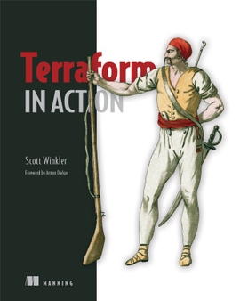

# Terraform In Action


[**Buy Terraform In Action Here**](https://www.manning.com/books/terraform-in-action?query=terraform%20in%20action)

**Aliases used**:  
(add these into your `~/.bashrc`, `~/.bash_profile`, `~/.zhrc`, etc. and use `source` command to apply them.)
```
alias t=terraform
export $aa="-auto-approve"
```
---
## Chapter 1
##
**Hello World!**  
[**Documentation**](https://github.com/devdot4/terraform-in-action/tree/main/chapter-1/listing-1#chapter-1)
|1.1|[main.tf](chapter-1/listing-1/1.1/main.tf)|
----|-----------|
|**1.2**|[**main.tf**](chapter-1/listing-1/1.2/main.tf)|
|**1.3**|[**main.tf**](chapter-1/listing-1/1.3/main.tf)|
---